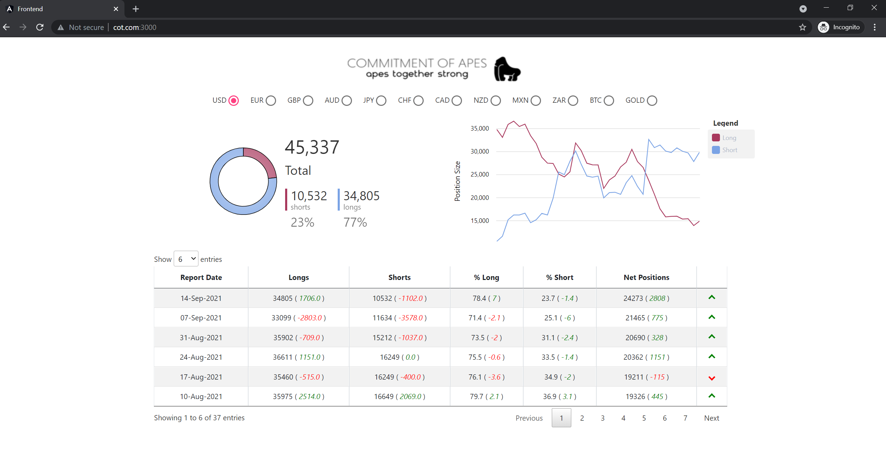

- # COT Report app

- build the frontend image
- ```>> docker build -t davidjmartin/cot-report-frontend:latest```


- mvn clean install

  - ```cd deployment```
  - ```helm install cot-app```


- update host file (C:\Windows\System32\drivers\etc\hosts)
  - ```127.0.0.1 cot.com```


- access front end via
- ```cot.com:3000```


## example screenshot


# Confluent Kafka
https://docs.confluent.io/operator/current/co-quickstart.html
https://stackoverflow.com/questions/59565537/how-to-query-directly-from-a-kafka-topic